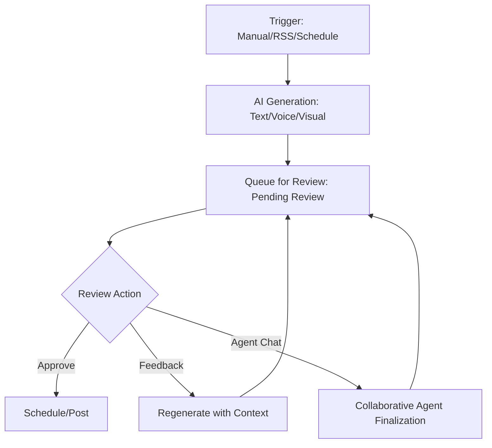
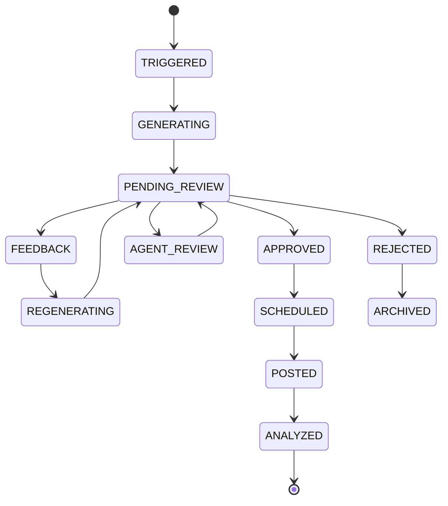

# Social Engine Content Pipeline Architecture

## Overview
The content pipeline is designed for "Full-Auto with Human-in-the-Loop" (HITL) generation. It supports various triggers, fully automatic generation across multiple modalities (text, voice, visual), and a robust review/feedback mechanism.

## Pipeline Flow

## Detailed Architecture

### 1. Triggers
- **Manual**: Dashboard "Create" button.
- **Automated**: n8n workflows (RSS feeds, webhooks).
- **Scheduled**: Recurring content rules (e.g., "Weekly highlights").
- **Agentic**: Proactive suggestions based on user posting patterns.

### 2. Generation (Multi-modal)
- **Text-gen (Gemini)**: Captions, hashtags, platform-specific adaptations.
- **Voice-gen (XTTSv2)**: Narration audio (for Creator+ tiers).
- **Visual-gen (Stub/SVD)**: Background imagery or video snippets.
- **Composer (FFmpeg)**: Final assembly into vertical 9:16 packages.

### 3. Review & Feedback Loop
- **Pending Review Status**: Default state for all generated content.
- **Inline Feedback**: User provides natural language feedback (e.g., "More professional tone").
- **Agent Collaboration**: User can chat with an agent to iterate on specific frames or sections.
- **Auto-Approve Rules**: Users can define trusted rulesets to bypass manual review after a high success rate.

### 4. Posting
- **Zernio API**: Primary provider for multi-platform distribution.
- **Retry Logic**: Automatic handling of API failures or rate limits.

## State Machine Diagram

## Technical Implementation Notes
- **Orchestration**: Express API Gateway handles the service handoffs.
- **Persistence**: MongoDB Token Vault for scheduling state and post history.
- **Messaging**: (Optional) BullMQ or similar for handling long-running generation tasks.
